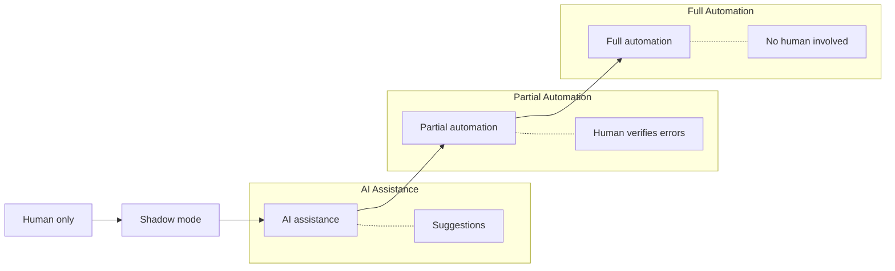
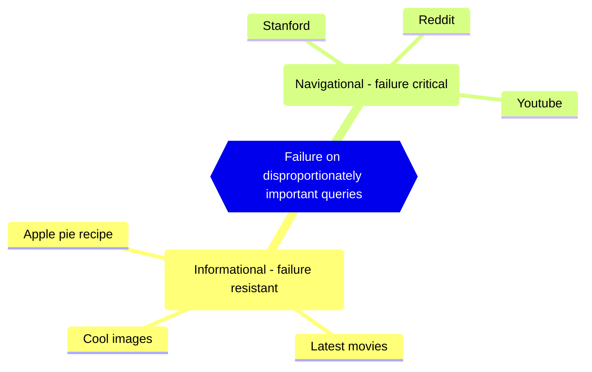

This article will use some images which belong to: [Machine Learning in Production - DeepLearning.AI](https://www.deeplearning.ai/courses/machine-learning-in-production/)

In reality creating a model does not equate to production deployment.
You need a lot more than just a working PoC.![[Pasted image 20250605203444.png]]
![[Pasted image 20250605203952.png]]
Speech-to-Text model:
- Data normalization, data labeling and conventions play important role in model training. How would you approach noise, silence period after the recording, how to perform volume normalization? In real life data can be unclear and inconvenient.
- Modeling, includes code, data and hyperparameters. Error analysis can help you with which data you do need to collect.
- Deployment, take microphone recording put it in voice outputting detection (which takes only human speech audio), sending data to prediction server, transcript, and search results returned. It's important to have ability to reflect on data model.

# Deployment
From building the software to creating the underlying infrastructure, including software maintenance.
- **Concept drift**
	- Teenagers will use speech model, but we trained it on adult voices, performance may degrade.
	- We calculate house value, but due to rapid inflation low category houses costs like middle.
- **Data Drift:**
	- If the number of said houses (input distribution) changes since people build more cheap housing. 
We should have monitoring to trace it and know ways of fixing it. 

What should we check before release:
- **Real-time or batch updates?** Can we update/ingest/index at /noon/day/morning or overnight?
- **Cloud or Edge?** Do we process data on a server or on the device?
- **Compute resources?** How much CPU/GPU/memory would we need for the model to be available to the customer.
- **Latency, throughput (QPS)**: how many concurrent requests can we process and how quick will it be? In real time speech recognition we generally need below second processing time.
- **Security and privacy:** what are the requirements for cloud/edge? Are we within PCI DSS, HIPAA standards? How can we secure both our and user data? 
- **How do we rollback?** When applicable.

## Deployment patterns
**Degrees of automation**
Both **AI Assistance** and **Partial Automation** approaches are generally called **Human in the loop** deployments/workflows because human verifies ML output.

**Shadow deployment of ML model**, factory case.
ML algorithm shadow a human worker (physical quality assurance) and reports on inputs.
ML result does not influence any decision on this stage, but feedback is collected.
![[Pasted image 20250609231517.png]]

**Canary deployments**
ML algorithm is used in, for example, 5% of all incoming data (freshly assembled smartphones), so if ML has high false report rate it wont affect huge volume of production.![[Pasted image 20250609232200.png]]

**Blue green deployment**
Logical router switches traffic from old model to a newer model, percentage can vary. Most compatible with rollback mechanism.![[Pasted image 20250609234946.png]]
## Monitoring
What do we monitor?
- Brainstorm what can go wrong
	- For things that can go wrong brainstorm statistics/metrics that will detect.
- It can be beneficial to begin monitor many components and the gradually remove the ones that are useless.
- Set thresholds for alarms and adapt metrics overtime

**Key metrics**

| Category             | Metrics                                                                                             |
| -------------------- | --------------------------------------------------------------------------------------------------- |
| **Software metrics** | Memory, compute, latency, throughput, server load                                                   |
| **Input metrics**    | Avg input length, Avg input volume, Num missing values, Avg image brightness                        |
| **Output metrics**   | # times return " " (null),  # times user redoes search,  # times user switches to typing, CTR |
# Modeling
It is helpful to view this iterative process trough data driven lenses, there was a lot of research on coding part. Though data is still there and generally just getting more data is not a tangible solution to improve the model. There are tools to help me extract max value from the data to improve your models.
When training a model consider the following milestones
1. Doing well on training set
2. Doing well on dev/test set
3. Doing well on business/project goals/metrics
## Caveats
**Query importance**
Consider the following diagram, users are unforgiving when we fail at locating proper result for navigational queries.

Another example is discrimination, make sure to not discriminate people by protected characteristics and others: [Discrimination: your rights: Types of discrimination ('protected characteristics') - GOV.UK](https://www.gov.uk/discrimination-your-rights).
This also includes product recommendations, also be careful and treat fairly (ecommerce) all major user, retailer, and product categories

**Rare classes** (skewed distribution).
>In medical diagnosis, it is not uncommon for many patients not to have a certain disease. Consequently, if you have a dataset that is 99 percent negative examples—because 99 percent of the population does not have a particular disease, with only one percent positive. You can achieve excellent test set accuracy by writing a program that simply outputs "0".

**BUT! This 1% misdiagnosis could lead to death.** This is not acceptable. You need to make sure that you can detect this 1% and your ML algorithm didn't "got used" printing "0"

## Consider establishing baseline.

You may focus on a component only to find that a humans (HLP) performs as good as model for a specific condition. This way you can find other areas to improve. Understand that HLP is generally useful with unstructured datatypes.
![[Pasted image 20250610023443.png]]

Also, research state of the art (via literature search) or open source solution that are available. Or quick and dirty implementation to see what is possible where to go next. And finally performance of older system.

If you doing production system pick something reasonable, not something latest, spend some time on literature. In production your task is to deliver. Think about performance constraints after you established baseline. Try training on smaller dataset (overfit) to see for code erros and whether it works at all, before running through giant dataset. You find bugs faster this way. Same goes for image segmentation. And for classification, use 10-100 classifiers instead of 10000000.

Initially people worked with spreadsheet to mark miss-predictions when training, but now there are tools, like LandingLens
![[Pasted image 20250610025853.png]]
Cross referencing failures with tags
![[Pasted image 20250610030212.png]]![[Pasted image 20250610030356.png]]
![[Pasted image 20250610030817.png]]
![[Pasted image 20250610031016.png]]![[Pasted image 20250610031102.png]]

Skewed dataset.

y=0 true, no defect
y=1 false, has defect

You can make a matrix to determine precision within a skewed dataset. Determine True/False Positives/Negative to establish precision and recall rate
>**Recall** is a metric that measures how often a machine learning model correctly identifies positive instances (true positives) from all the actual positive samples in the dataset
>**precision** measures the accuracy of a model's positive predictions. It calculates the ratio of true positives to the total number of positive predictions made by the model

$$\text{Precision} = \frac{\text{TP}}{\text{TP+FP}}$$
$$\text{Recall} = \frac{\text{TP}}{\text{TP+FN}}$$
$F_1$ score formula can figure harmonic mean between precision and recall. Intuition is that you want your algorithm to be good at both.
$$ F_1 = \frac{2}{\frac{1}{P} + \frac{1}{R}} $$

![[Pasted image 20250610154339.png]]![[Pasted image 20250610155907.png]]
This can help with multi-class metrics. We may empathize on the achieving high recall
![[Pasted image 20250610160129.png]]
Performance auditing
![[Pasted image 20250610160622.png]]![[Pasted image 20250610160922.png]]

Data augmentation
Take sound add background noise like cafe and you have like in real life example of real recording. Realistic examples. Examples should be hard enough, but now over the top that even human cannot understand.
![[Pasted image 20250611012051.png]]

Though algo can degrade if we of more than two similar characters upload more images of one than the other. This will skew dataset.
![[Pasted image 20250611012655.png]]

Consider adding feature which help model, like figuring out beforehand how likely the person is vegetarian before we suggest a restaurant ![[Pasted image 20250611013534.png]]

Experiment tracking
![[Pasted image 20250611013717.png]]![[Pasted image 20250611015632.png]]

# Data

Label ambiguity, sometimes can be dealt with UID matching, but you need to do it in a ways to respect user privacy if you figuring whether two accounts belong to human. Have permission.

![[Pasted image 20250612032706.png]]

Data augmentation is not helpful in unstructured data![[Pasted image 20250612034233.png]]
![[Pasted image 20250612034543.png]]
![[{CA688C30-7220-4C42-9214-A29B791B9BF4}.png]]

![[Pasted image 20250612035422.png]]
Separate label of uncertainty
![[Pasted image 20250612035355.png]]
Beatring HLP as proof of ML superiority, tyhough algorithms can have advantage beforehand, not stat accurate.
![[Pasted image 20250612035811.png]]
![[Pasted image 20250612035904.png]]
If you unsure how long to collect data, start small
![[Pasted image 20250612040230.png]]![[Pasted image 20250612040517.png]]
![[Pasted image 20250612040723.png]]![[Pasted image 20250612041219.png]]![[Pasted image 20250612041635.png]]![[Pasted image 20250612042447.png]]
![[Pasted image 20250612043514.png]]