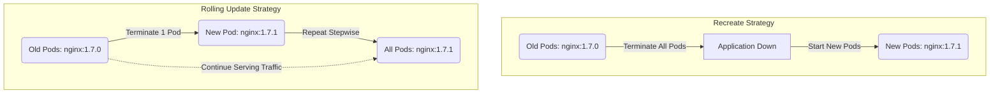

Automates (orchestrates) Docker to scale, check for errored out containers and etc.

Both combined with [[Docker]] allows us to deploy immutable infrastructure where both system and the application can be represented as a single artifact. Combining with [[git]] such artifacts can be represented in "single source of truth" - a repository which contains underlying configuration
[CNCF Landscape](https://landscape.cncf.io/)
# Theory

![[Pasted image 20250527095536.png]]
- CRI used to execute and run container processes in pods.
	- Mostly `containerd` and `cri-o`
- CNI user to define networking.
	- Cloud specific or Open Source Calico, Flannel, Cilium
- CSI managing storage and volumes.
	- Cloud specific plus cert manager and secrets store CSI Driver
## Architecture (control plane)
![[Pasted image 20250624211714.png]]
### Cluster control plane
Manages all scheduling, application, scaling, and deploying Kubernetes. **Nodes** serve as workers in the K8S cluster. Required components which must be installed on every node are:

- **Container runtime** - runs the container
- **Kubelet** - intermediary between container and node. Executes operations on pods in the node
- **Kubeproxy** - applies smart routing of requests (LB), a-la send requests to DB components which are closer (inside the same node)

Services are used to connect between nodes.

**Master nodes** serve as a controller for nodes. You can have multiple of them deployed for redundancy. Required components which must be installed on every master node are:
- **API Server (kube-apiserver)** - accepts all requests coming in or queries from the cluster (UI, API, CLI). Gatekeeps authentication of requests to the cluster.
- **Scheduler (kube-scheduler)** - balances new deployments and scale requirements via load balancing on computing resources.
- **Controller Manager (kube-controller-manager)** - detects state changes of pods and redeploys them via Scheduler communication.
- **etcd** - key-value store, cluster brain, changes written there. Has data on load, usage, etc. Does not store app data.

![[kubernetes-cluster-architecture.svg]]
It all works in scales motion where when you create a deployment it also create `ReplicaSet` which creates `pods`. Also if there is already a stray pod with matching label it will be removed by deployment since pods will be created regardless and stray pod will hit with limit condition
### Data Plane
- **`Pod`** - an abstraction over containers, can contain multiple containers
	- e.g. Init container (run before), plus sidecars (run along) and primary
	- Usually 1 app/DB per pod
	- Pod get an internal IP address, (ephemeral)
	- ![[Pasted image 20250527170116.png|300]]
	- ![[Pasted image 20250615013217.png|300]]
- **`Job`** is an ad-hoc (single use) work until completion container configuration, creates one or mode pods, completes. Pods also assigned random name Set backoffLimit![[Pasted image 20250528152516.png]]
- **`CronJob`** is like job, but can be scheduled based general [[CRON Scheduler]] rules
- **`DaemonSet`** runs a copy of a container pod an all or (selected subset of) nodes in the cluster (brings propagation). Good for monitoring, log aggregation or storage daemon. Does not target control plane
- **`Namespaces`** separate resources like groups avoid name conflicts, but don't act as security/network boundary by default. 
	- The list of default namespaces
	- ![[Pasted image 20250527163846.png]]
- **`Node`** - hosts pods
- **`Service`** - [[#Networking - Service or Ingress]]
- **`Ingress`** - helps setting up URL, secure protocol and domain name. 
	- **Accepts requests and can route to multiple Services**
	- Acts like an API Gateway (K8S slowly replaces Ingress with GatewayAPI element)
- **`GatewayAPI`** - Evolves form GatewayAPI and support Network gateways![[Pasted image 20250612220443.png]]
- **`Configmap`**: -  maps variables between pods and external services (like DBs credentials and URLs) property-key and file-like-keys![[Pasted image 20250528214152.png]]
	- Passwords are not stored in config map
- **`Secrets`**: where you store credentials, encodes in base64, can be controlled via authorization policies.![[Pasted image 20250528220123.png]]
	- Not enabled by default.
	- **Both `Secrets` and `configmap` can be used by app though env vars.**
- **`ReplicaSet`** adds replication (a subset of a deployment)
	- **`Labels` link `ReplicaSets` and `Pods`**
	- ![[Pasted image 20250527172911.png|300]]
- **`Deployment`**: creates blueprints for pods, automates replication adds concepts of rollout and rollbacks, adds revisions akin versioning, implements [[Business Resilience and Reliability#High availability (HA)]].
	- When deployment created a rollout is triggered, each rollout creates a deployment revision which allows us to rollback in version.
	- Utilizes `ReplicaSet` for replication of pods. For example, via deploying a new node with same pods setup.
	- Can't replicate pod dbs, because they have state - data
- **`Statefulsets`** - gives pods sticky identity (0,1,2... naming), each pod mounts separate volumes and rollout is by order. Helps preserve state, for example, helps DBs like primary vs read replica. Deployment for stateful application.
	- Pods created in order, one after another, when scaled down last created are deleted
	- Pods get predictable names -0/1/2/3/4
	- Either use this or deploy DB outside K8S in a highly available infra, like cloud.
	- You cannot modify many of the created fields from YAML, like storage size/request!
	- Has field `serviceName`, i.e. creating dns service for each replica independently (as if each pods got dns name), so in Service declaration you should make it **headless** with `type: ClusterIP` and `ClusterIP: None` ![[Pasted image 20250528213300.png]]
	- **Why headless** Each connection to the service is forwarded to one randomly selected backing pod. But what if the client needs to connect to all of those pods? What if the backing pods themselves need to each connect to all the other backing pods. Connecting through the service clearly isn’t the way to do this. [Service \| Kubernetes](https://kubernetes.io/docs/concepts/services-networking/service/#headless-services)
	- `StatefulSets` currently require a [Headless Service](https://kubernetes.io/docs/concepts/services-networking/service/#headless-services) to be responsible for the network identity of the Pods. You are responsible for creating this Service.
- **`PersistentVolume`** and **`PersistentVolumeClaim`** stores data persistently, functions as emulated physical storage. PVC is a declaration of need for storage that can at some point become available / satisfied - as in bound to some actual PV. PVC consumes PV. StatefulSet volumeClaimTemplate enables dynamic provision of PV. ![[Pasted image 20250612222656.png]]
	- Provisioned via PVs, generally via user, via Storage Classes SC
	- The basis can be local or remote like (s3)
> [!Example] `PersistentVolume` and `PersistentVolumeClaim` on
> | Resource                    | Namespaced? | Visible across Namespaces? | Notes                                |
| --------------------------- | ----------- | -------------------------- | ------------------------------------ |
| PersistentVolume (PV)       | ❌ No        | ✅ Yes                      | Like shared storage pool             |
| PersistentVolumeClaim (PVC) | ✅ Yes       | ❌ No                       | Tied to 1 namespace                  |
| Pod                         | ✅ Yes       | ❌ No                       | Must mount PVCs in its own namespace |
- `RBAC` (`ServiceAccount`, `Role`, `RoleBinding`) - Service account is an auth object, role if what pods address to and `RoleBinding` merges these two entities. `Role` is `namespace` level while `ClusterRole` is `cluster` level ![[Pasted image 20250612223255.png]]
- `Labels` and `Annotations`:![[Pasted image 20250612224508.png]]
You can get explanation of template formats via
`kubectl explain <component>` or `kubectl explain <component>.`
[GitHub - BretFisher/podspec: Kubernetes Pod Specification Good Defaults](https://github.com/BretFisher/podspec) 
![[Pasted image 20250527170641.png]]
#### Deployment
There are two deployment strategies, these are defined in `.spec.strategy.type`
- `RollingUpdate`: gradually replace old pods with new ones.
	- Logs: gradual scale down of old `ReplicaSet` and scale up of new `ReplicaSet`
- `Recreate`: terminate all pods, create new ones.
	- Logs: total scale down of old `ReplicaSet` and scale up of new `ReplicaSet`.

Check rollout status with `kubectl rollout status` and history with `kubectl rollout history`.

Rolling back is possible via `kubectl rollout undo deployment/myapp-deployment`. For these actions you can see the difference in `ReplicaSet` behavior, for example, before and after `rollout undo`:
![[Pasted image 20250624220522.png]]

You can add `--record` to command affecting deployments which will register the use of the command in `kubectl rollout history`.

You can perform ad-hoc update of the deployment configuration with `kubectl set image deployment/frontend simple-webapp=kodekloud/webapp-color:v2`, but this **won't update** the definition file, so it's better to change config in file, GitOps way.![[Pasted image 20250625002550.png]]

There are two ways of manually scaling down the deployment:
- Reduce `replicas` parameter in manifest and `kubectl replace -f xx.yaml`
- `kubectl scale <type> --replicas=6` or `kubectl scale -replicas=6 -f xx.yaml

> [!question] apply vs replace
> `apply` acts as incremental update and does not change selectors. `replace` completely sets a new deployment.

In deployment labels work as additional identifiers, for example you can distinguish environment (prod, dev, stage, test) with it.

Selectors link deployment configuration to specific pods. Matches selector to a pod's `template: metadata: label:`

> [!tip] Labels, Selectors & Namespaces
> **Labels** are classic key-value pairs, modifiable.
> **Selectors** are used in manifests, to filter and act on resources under the label.
> ![[Pasted image 20250422004946.png]]
> **Namespaces** on are strictly separate resources in the cluster, so they have separate RBAC, quota and network policies

Standard practice name key as app if you deploy application, so `app: nginx`
#### Networking - Services, Ingress, and Gateway API
The ultimate purpose of these networking components is to enable users/edge devices to access our application, though they achieve it differently.
> [!info] Low Level Networking
> Kubernetes expects that nodes and pods within a cluster can communicate with one another without relying on [[NAT]]. There are solutions to enable this, [CNI overview \| Ubuntu](https://ubuntu.com/kubernetes/charmed-k8s/docs/cni-overview#:~:text=Supported%20CNI%20options) if you want to self host Kubernetes, the list is not full. Cloud providers use something on their end. In the end your K8S Cluster allocates IPs and setups necessary routing between nodes under the hood.

![[Pasted image 20250528140816.png|500]]
 A Service uses selectors to determine which Pods it should route traffic to, based on the labels those Pods have.
1. Kind: **Service** (based on selector match with labels defined in Deployment)
	1. **ClusterIP**: Internal to Cluster. Services are reachable by pods/services in the Cluster.
	2. **NodePort**: Can multi-node. Balancing Algorithm: Random. 
	   Services are reachable by clients on the same LAN. Note for security your k8s host nodes should be on a private subnet, thus clients on the internet won't be able to reach this service. ![[Pasted image 20250625012955.png|500]]
	3. **LoadBalancer**: Provisions external facing LB. Services are reachable by everyone connected to the internet (Common architecture is L4 LB is publicly accessible on the internet by putting it in a DMZ. Or giving it both a private and public IP and k8s host nodes are on a private subnet) (sudo $(which cloud-provider-kind) for local k8s so that LB works)
2. Kind: **Ingress**
	1. Expose to internet, route to multiple services, setup advances HTTP stuff, works similarly to an API.
> [!tip]
> Generally people tend to assign same values to `port` and `targetPort` , to keep things simpler.

Kubernetes has internal DNS service like [[Docker#Docker Compose]] so you can resolve a Service within a pod.
![[Pasted image 20250528142410.png]]
If you are within the same namespace you can resolve short name
![[Pasted image 20250528143121.png]]
If you are reaching over namespaces, use [[DNS#^d3c822|DNS FQDN]]
![[Pasted image 20250528144320.png]]
# Helm
Distribution and versioning of Kubernetes applications.
![[Pasted image 20250612225045.png]]
It is good at templating.
![[Pasted image 20250612225407.png]]
`values.yaml` can have a supplementary `values.schema.json` to define a schema for values. Useful for error prevention

Helm history of the releases in secrets of the clusters

# In practice

## CLI - kubectl

List all pods in the namespace
`kubectl get pods -n new-prod`

List pods and include additional info
`kubectl get pods -o wide`

Create curl pod (only use this way as demonstration)
`kubectl run curl-pod  -it --rm --image=curlimages/curl --command -- sh`
![[Pasted image 20250528143121.png]]

How replication works in practice:
![[Pasted image 20250616085032.png|400]]

Dry run to preview changes:
`kubectl create -f replicaset-definition-1.yaml --dry-run=client`
![[Pasted image 20250616225056.png]]
Execute command in the container, like docker exec:
`kubectl exec configmap-example -c nginx -- cat /etc/config/conf.yml`
Pod name, container, command.
![[Pasted image 20250528215644.png]]

You want to create a config file type of secret like![[Pasted image 20250528222046.png]]
To simplify you can do it via cli and the add `--dry-run=client -o yaml` so you can get it ready to copy and paste into a file. Here is comparison where first command creates and other provides it for the file
![[Pasted image 20250528222011.png]]![[Pasted image 20250528222234.png]]
Direct monitoring with , but better to use Prometheus and Grafana

To apply multiple:
`kubectl apply -f 01_pods.yml -f 02_pvc.yml`
## Status to Errors

> [!tip]
> `BackOff` is incremental increase of wait time before retry

- `ImagePullBackOff` initial image pull failed, will `BackOff` retries
	- `ErrImagePull` failed to pull image, does not exist or no access
- `CrashLoopBackOff` 

# Q&A
1. `Metadata: name:` vs `spec: containers: - name:` 
	1. Name in metadata refers to the pod name, while name in container spec refers to a container's name.
2. `no matches for kind "ReplicaSet" in version "v1"`
	1. You probably made a mistake in `apiVersion`
3. . Limits vs Requests
	1. Requests defines how much pods is gonna use and uses this information to find proper node.
	2. Limit restricts how much pods can actually use
	3. If equal, then QoS status becomes "guaranteed" 
4. How to go inside pods and get logs form containers?
	1. 
5. `kubectl apply` vs `kubectl replace`
	1. Some resources have immutable fields that apply won't let you change. For example, a deployment cannot have its selectors changed. Replace can be used in these situations.
6. `x node(s) had untolerated taint` 
	1. [Taints and Tolerations \| Kubernetes](https://kubernetes.io/docs/concepts/scheduling-eviction/taint-and-toleration/)
	2. If you are in the lab, make sure you aren't deploying to control plane node. Control plane nodes have taints by default.

