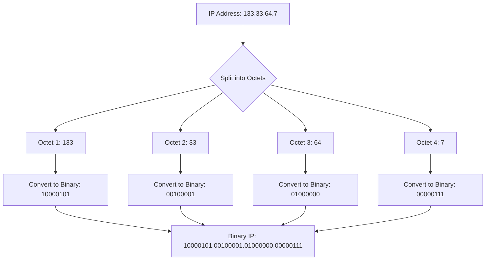

#it_theory/osi
# Calculating subnet size

Imagine boundaries 8-16-24-32. Start from smaller boundary, if subnet is smaller than the boundary, subtract subnet from boundary. Example: 133.33.86.7/18

Get number of subnets in a network: 2bits taken
-    /27 = (27-24) = 23 = 8 subnets
Get number of hosts in a subnet: 2bits free
-   /27 = (32-27) = 25= 32 hosts (block size)
Get number of usable hosts in a subnet: {subsize} - 2
-   256 hosts - 2 = 254 usable hosts  

Get number of IPs in a subnet
1.  Count free bits
2.  /18 gets = 2^(32-18)=16384
3.  Number of IPs 16384 , 11111111.11111111.11000000.00000000  

Get subnets first and last address of 133.33.86.7/18
1.  Count the block size
2.  For /18 next boundary is 24, counting 2^(24-18)=64
3.  So the block size is 64 in decimal view in subnet part of the IP.
4.  Considering netmask is on 3rd octet and given IP 133.33.86.7, count
5.  133.33.0.0/18 – not our subnet, before  
	1. 133.33.64.0/18 – our subnet because
	2. 133.33.64.0 - Base IP
	3. 133.33.64.1 - First usable
	4. 133.33.127.254 – Last usable
	5. 133.33.127.255– Broadcast
6. 133.33.255.255 - Last  
7. 133.33.128.0/18 – Next subnet
[GUIDE FOR SUBNETTING](https://community.infosecinstitute.com/discussion/38772/subnetting-made-easy)

# Conversion of Decimal to Binary
Decimal IP octet (e.g. 133.) will be noted as digit.

Octets contain bits from 128 to 1 (each following is divided by two)

|  1  |  2  |  3  |  4  |  5  |  6  |  7  |  8  |
| :-: | :-: | :-: | :-: | :-: | :-: | :-: | :-: |
| 128 | 64  | 32  | 16  |  8  |  4  |  2  |  1  |
To covert decimal IP address into binary, use this table
1.  If digit is more or equals to binary position value, then subtract and add 1 in the position, continue the same for remainder.
2.  If digit is less then binary position value, then skip.
![[Pasted image 20230121152800.png]]
![[Pasted image 20230121152830.png]]