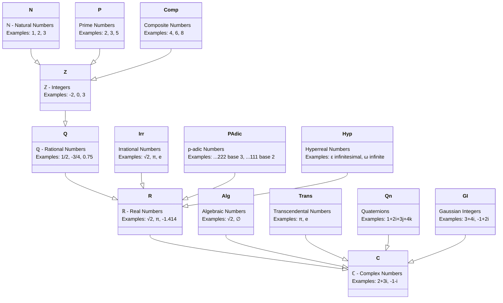

This article will use some images from: [3Blue1Brown](https://www.3blue1brown.com/lessons), [Math Academy](https://www.mathacademy.com/), [Why Machines Learn by Anil Ananthaswamy](https://www.penguin.co.uk/books/446849/why-machines-learn-by-ananthaswamy-anil/9780241586488)

I study math, these are my notes, I figured it would be great to make an article of that. This article mainly English, but there is some Russian generally as a translation, since math is whole another language...

> [!Tip] Glossary and translation
> 
> - **Integer** - Целое число, e.g., $-1 \leq x \leq 1, \dots$
> - **Addition** - Сложение
> - **Addend** - Слагаемое
> - **Sum** - Сумма  
>     $$ \begin{align} \underbrace{7}_{\text{Addend}} + \underbrace{4}_{\text{Addend}} = \underbrace{11}_{\text{Sum}} \end{align} $$
> - **Subtraction** - Вычитание
> - **Minuend** - Уменьшаемое
> - **Subtrahend** - Вычитаемое
> - **Difference** - Разница  
>     $$ \begin{align} \underbrace{10}_{\text{Minuend}} - \underbrace{4}_{\text{Subtrahend}} = \underbrace{6}_{\text{Difference}} \end{align} $$
> - Разница между уменьшаемым и вычитаемым — это разность, разница между уменьшаемым и разностью — это вычитаемое.
> - **Multiplication** - Умножение
> - **Multiplier** - Множитель
> - **Multiplicand** - Множитель
> - **Product** - Произведение  
>     $$ \begin{align} \underbrace{6}_{\text{Multiplier}} \times \underbrace{3}_{\text{Multiplicand}} = \underbrace{18}_{\text{Product}} \end{align} $$
> - **Division** - Деление
> - **Dividend** - Делимое
> - **Divisor** - Делитель
> - **Quotient** - Частное  
>     $$ \begin{align} \underbrace{15}_{\text{Dividend}} \div \underbrace{3}_{\text{Divisor}} = \underbrace{5}_{\text{Quotient}} \end{align} $$
> - **Mathematical Properties**  
>     $$ \begin{align} \underbrace{k \times 1 = 1 \times k = k}_{\text{Multiplicative Identity}} \end{align} $$  
>     $$ \begin{align} \underbrace{n / 1 = n}_{\text{Division by One}} \end{align} $$  
>     $$ \begin{align} \underbrace{m \times 0 = 0 \times m = 0}_{\text{Zero Property of Multiplication}} \end{align} $$  
>     $$ \begin{align} \underbrace{n / n = 1 \ (n \neq 0)}_{\text{Division of a Number by Itself}} \end{align} $$
> - **Hundredths place** - Класс сотен
> - **Mathematical expression** - Математическое выражение
> - **Quantitative** - Количественный
> - **Ordinal** - Порядковый
> - **Fractions** - Десятичные дроби
> - **Scalar** - Скаляр
> - **Vector** - Вектор
> - **Magnitude** - Магнитуда, "speed" of a vector
> - **Reciprocal (Multiplicative inverse)** - Обратное число
> - **Greatest Common Divisor (GCD)** - НОД
> - **Least Common Multiple (LCM)** - НОК
> - **Common Denominator** - Общий знаменатель

# Tricks
1. Multiplication table: when multiply by 9 use finger for multiplicand, so to the left you will be tens place and to right will be ones place so: $9\times7=63$, as shown below:
![[1.1.4__Kartinka_v_teoriiu_2_rf_1632842845.png|400]]
2. Multiplication table: multiply by 10 and reduce by amount of multipliers: $9 \times 8 = 90 -  9 \times 2$
3. Multiplication: when multiplying a double-digit number 11 you just expand multiplier and add sum digits in between (if sum bigger than 9 add tens to first digit):

$$\begin{array}{c} \text{Example 1: } 45 \times 11 \\[-0.2em] \text{Step 1: Start with } 45 \\[-0.2em] 45 \\[0.5em] \text{Step 2: Separate } 4 \text{ and } 5 \\[-0.2em] 4 \quad \_\quad 5 \\[-0.2em] \swarrow \quad \quad \searrow \\[0.2em] \text{Step 3: Insert sum } 4 + 5 = 9 \\[-0.2em] 4 \quad 9 \quad 5 \\[0.5em] \text{Step 4: Result } 45 \times 11 = 495 \\[-0.2em] 495 \\[1em] \text{Example 2: } 78 \times 11 \text{ (sum } 7 + 8 = 15 \text{)} \\[-0.2em] \text{Step 1: Start with } 78 \\[-0.2em] 78 \\[0.5em] \text{Step 2: Separate } 7 \text{ and } 8 \\[-0.2em] 7 \quad \_\quad 8 \\[-0.2em] \swarrow \quad \quad \searrow \\[0.2em] \text{Step 3: Insert units of } 15 \text{ (5), add tens (1) to } 7 \\[-0.2em] (7+1) \quad 5 \quad 8 \\[-0.2em] 8 \quad 5 \quad 8 \\[0.5em] \text{Step 4: Result } 78 \times 11 = 858 \\[-0.2em] 858 \end{array}$$

4. Multiplication: if you divide first by two and multiply second by 2 the result will be the same, like 16 X 45 becomes 8 X 90 which is easier to calculate
5. Instead of subtracting and adding by 9, do it by 10, if 99 do it by 100, example: $25+9=25+10−1$
6. If you add multiple numbers start with the ones that easy: $45+17+5 = 50+17$
7. You can quickly verify subtraction or addition by checking the last number of produce, for example $387+604=990$ is false because $7+4=11$, where 1?
# Basic Math
Keep in mind order of operations:
![[PEMDAS-min.png|400]]
## Number types and systems

![[Long Division.excalidraw]]
## Power
Exponent is power symbol. Example of equal exponent manipulations:
$$
\begin{array}{c}
\text{\textbf{Multiplication of Powers with Equal Exponents}} \\[0.5em]
\text{The product } 2^3 \times 5^3 \text{ can be written as } 2 \times 2 \times 2 \times 5 \times 5 \times 5. \\[0.5em]
\text{in multiplication we can rearrange for simplicity} \\[-0.2em]
\text{If we group all products of 2 and 5, we get} \\[-0.2em]
(2 \times 5) \times (2 \times 5) \times (2 \times 5) = 10 \times 10 \times 10 = 10^3. \\[0.5em]
\text{General form:} \\[-0.2em]
n^2 k^2 = n \times n \times k \times k = (n k) \times (n k) = (n k)^2.
\end{array}
$$
Property combination:
$$
\begin{array}{c}
\text{\textbf{Combining Properties}} \\[0.5em]
\text{Example: } 2^7 \cdot 5^2 \\[-0.2em]
2^7 \cdot 5^2 = 128 \cdot 25 \\[0.5em]
\text{Simplify: } 2 \cdot 5 = 10 \\[-0.2em]
2^7 \cdot 5^2 = 2^5 \cdot 2^2 \cdot 5^2 = 2^5 \cdot (2 \cdot 5)^2 \\[-0.2em]
= 2^5 \cdot 10^2 = 32 \cdot 100 = 3200
\end{array}
$$
Power with negative numbers, usually you put negative in parenthesis for that, 
$$(-2)^2 = (-2) \times (-2) = 4$$
Power with natural numbers
$$
\begin{array}{c}
\text{First method:} \\[-0.2em]
(2^3)^2 = (2^3) \times (2^3) = 8 \times 8 = 64 \\[0.5em]
\text{Second method:} \\[-0.2em]
(2^3)^2 = 2^{3 \times 2} = 2^6 = 64
\end{array}
$$
Simplifying same dividend fraction division
$$
\begin{array}{c}
\text{Step 1: Simplify the fraction} \\[-0.2em]
\frac{8^7}{8^4} = 8^{7-4} = 8^3 \\[0.5em]
\text{Step 2: Compute } 8^3 \\[-0.2em]
8^3 = 8 \times 8 \times 8 = 64 \times 8 = 512 \\[0.5em]
\text{Step 3: Result} \\[-0.2em]
\frac{8^7}{8^4} = 512
\end{array}
$$
## Ratios
Calculating missing number from ratio table.

| numerator | denominator |
| :-------: | :---------: |
|     5     |     10      |
|    10     |      ?      |
|    20     |     40      |
Let's calculate, starting with $\frac{5}{10}$ we need to scale numerator 5 to 10, can be done with multiplication by 2, $\frac{5 \times 2}{10 \times 2}=\frac{10}{20}$ so the missing number is 20.

| numerator | denominator |
| :-------: | :---------: |
|     6     |     18      |
|     ?     |     24      |
|    20     |      ?      |
I case of missing numerator apply the same login and if we feel like it, divide numerator by itself to get smallest baseline, $\frac{6/6}{18/6}=\frac{1}{3}$ in this case we divide 6 by 6. 
1. For the second row we reference multiplication to find the multiplier: $3\times8=24$, so nominator is $1\times8=8$
2. For the third row see $1\times20=20$ so multiplier is 20 which means denominator is $3\times20=60$

| numerator | denominator |
| :-------: | :---------: |
|     6     |     18      |
|     ?     |     24      |
|    20     |      ?      |

### Unit rate

A **unit rate** is a comparison of two quantities where one of the terms has a quantity of  This means the ratio, in fraction form, has a denominator of 1.

We practically downsize fraction for ration so it is easier to calculate.
$$\frac{200}{4} = \frac{50}{1}$$
Just with fractions
$$ \frac{400/2}{6/2} = \frac{200}{3} $$
And with decimals to
$$
\frac{3 \times 5}{2 \times 5} = \frac{15}{10} = 1.5
$$
## Fraction manipulation
### Division
Of whole number by a fraction:
$$2 / \frac{1}{5}=2 \times 5=10$$
![[Pasted image 20250607114108.png]]
If the numerator of a fraction is a product of two numbers, you can rearrange the fraction by taking one of those numbers outside: $$\frac{a \times b \text{ (numerator)}}{c \text{ (denominator)}} = a \times \frac{b}{c} \text{ (move } a \text{ outside)}$$
If you multiply fraction,
$$\frac{2}{15} \times 60 = \frac{2}{15} \times \frac{60}{1} = \frac{2 \times 60}{15 \times 1} = \frac{2 \times 60}{15}$$

$$\frac{2 \times 60}{15} = 2 \times \frac{60}{15}, \quad \text{so} \quad \frac{60}{15} = 4, \quad \text{so} \quad 2 \times \frac{60}{15} = 2 \times 4 = 8$$
## Linear functions
![[Pasted image 20250601023638.png]]
# Advanced Math

# Statistics
## Standard Deviation
![[Pasted image 20250623041837.png]]

# Vectors
==fix headers==
### What is a Vector?
There are try approaches on what is a vector, mainly:
![[Perspectives.svg]]
Keep in mind, negative numbers in visual representation, also indicates motion. Positive numbers - rightward or upwards; negative numbers - leftward or downward. Each pair of numbers gives you one and only vector. 
#### Physics perspective
Vector is an arrow that points in space, defined by its length (magnitude) and direction. As long as these values don't change, you can move this arrow around (like left/right/up/down).
![[MagnitudeAndDirection.svg]]

#### CS Perspective
Vector is an ordered list of numbers, dimensions defined by amount of elements in the list, this is a two dimensional vector, order matters:
$$\begin{bmatrix} 2600m^2 \\ $300,000 \end{bmatrix}$$
#### Mathematician's Perspective
Generalizes aforementioned views, saying vector can be anything when there is a notion of adding two vectors or multiplying a vector by a number.![[MathematiciansPerspective.svg]]
This view seems abstract and it's better implement this when you are more knowledgeable on the topic.
### Vector theory over geometry
It's essential to know that geometrical view translates to CS view this way:  $\begin{bmatrix} \text{x-axis} \\ \text{y-axis} \end{bmatrix} \text{sign "-" is dash}$

**What about 3D space?**
In 3D, we add Z axis which is [perpendicular](https://en.wikipedia.org/wiki/Perpendicular) to both X and Y. 

top number - how far to move on X axis
middle number - how far to move [parallel](https://en.wikipedia.org/wiki/Parallel_(geometry)) to Y axis
bottom number - how far to move then parallel to the z axis
![[VectorCoordinates3d.svg]]
> [!important]
>  And scalar is number that will change the magnitude of the vector 2, -1.8 or 1/3. 
> Consider this example: $\frac{1}{3} \begin{bmatrix} 12 \\ 9 \end{bmatrix} = \begin{bmatrix} \frac{12}{3} \\ \frac{9}{3} \end{bmatrix}$

Though there is another way to look at it: it can be helpful to think of each vector coordinate as a scalar itself. Because each coordinate in a vector affects the overall, stretching or squishing the vector. Example with $\begin{bmatrix} 3 \\ -2 \end{bmatrix}$ will follow below.

>In the $xy$-coordinate system, there are two special vectors. 
>
>The one pointing to the right with length 1, commonly called "i hat" $\hat{i}$ or "the unit vector in the $x$-direction". 
>
>The other one is pointing straight up with length 1, commonly called "j hat" $\hat{j}$ or "the unit vector in the $y$-direction".
>
>Together they are "basis" of coordinate system
![[UnitVectors.svg]]

So effectively our coordinate numbers just scale those i and j.
![[VectorCoordinatesAsScalarsOfUnitVectors 1.svg]]

It's funny because we can choose other basis coordinate system, like say i = 2 and j = 3, vector result will be compared to i = 1 and j = 1.  So when you see a vector, make sure you know what coordinate system are you operating with.

There is a trick to sum vectors: 
1. takes 2 vector, move second one to the tip of first one so that it looks as if it vector w continues vector v.
2. draw a new line from center to where w points and this line will be the sum.![[VectorAddition.svg]]

> [!quote] Terminology
> When you sum vectors like it's called **linear combination**, linear because when you multiply scalar (6) by a vector (3 | 4) it changes magnitude of vector and if you multiply by every real number an infinite line would appear overpassing the origin and point defined.
> ![[LinearCombinationVectorsAndLines.svg]]

You can reach any point in 2D space by changing scalars.
![[LinearCombinationScalarsRangeFree.mp4]]
Except if vectors lineup or all are zero, then you would be unable to reach everything.  
![[LinearCombinationLinearlyDependent.svg]]
This is called **linear dependency**.
> Where you have multiple vectors, and you **could remove one without reducing their span**
![[LinearlyDependent-1.svg]]
#### Vectors vs Points
Vectors can be represented as points, it is generally good idea if you have multiple vectors.
![[point_space.png]]

If you think about all possible vectors sitting on a line, just think about line itself: ![[point_line.mp4]]
#### Span
A set of any possible combination we can reach with given pair of vectors is called the **Span**, i.e. how much we can reach just by vector addition and scalar manipulation?
##### Spans in 3D
If you take two vectors in 3D space and span them, nothing much will change, though their movement will be alike to orienting around on a thin sheet of paper, because we are missing the third.
![[IndepentOrDependent3d.svg]]
If third vector does not expand on third axis i.e. it sits within the span of the two vectors, than you will be trapped on that same sheet of paper.
![[ThirdVectorIsInSpan.mp4]]
Here vectors are linearly dependent
![[LinearlyDependent3d-1.svg]]
And if you choose third vector randomly, it most certainly will no sit in the span of these two, unlocking you access to every possible 3D vector.
![[ThirdVectorIsNotInSpan.mp4]]
And here vectors are linearly independent
![[LinearlyIndependent3d.svg]]
#### The book approach
 *A man goes 5 miles towards north-east location*

This question can be solved by visualizing as a vector and solving it geometrical way
Pythagorean theorem:
$$c=\sqrt{a^2+b^2}$$
Our vector, lets calculate magnitude.
$$
\sqrt{4^2 + 3^2} = 5
$$
In our example the magnitude of the vector is calculated as hypotenuse $c$.
![[Pasted image 20250530171156.png|300]]
Finishing up with resultant vector line which goes from start to finish, providing net distance in XY coordinate space 10.82. While total distance results in 11.23. In this instance two forces influence that single object at the same time producing the resultant vector, visualized via line.

![[Pasted image 20250530175024.png|300]]
This resembles a [parallelogram](https://en.wikipedia.org/wiki/Parallelogram), as Newton once stated:

> *A body by two forces conjoined will describe the diagonal of a parallelogram, in the same time that it would describe the sides, by those forces apart.*

## Notes
Sigma used to denote [Summation - Wikipedia](https://en.wikipedia.org/wiki/Summation) operation, in this case summing all $w_i x_i$ together producing $y$:
$$ y = w_1x_1 + w_2x_2 + w_3x_3 + \cdots + w_nx_n = \sum_{i=1}^{n} w_i x_i $$

This is XOR operation presented in math, $\theta$ theta,  means threshold value.
$$
g(x) = x_1 + x_2 + x_3 + \cdots + x_n = \sum_{i=1}^{n} x_i
$$
$$f(z) = \begin{cases} 
0, & z < \theta  \\ 
1, & z \geq \theta
\end{cases}$$
$$ y = f(g(x)) = \begin{cases} 
0, & g(x) < \theta  \\ 
1, & g(x) \geq \theta  
\end{cases}
$$